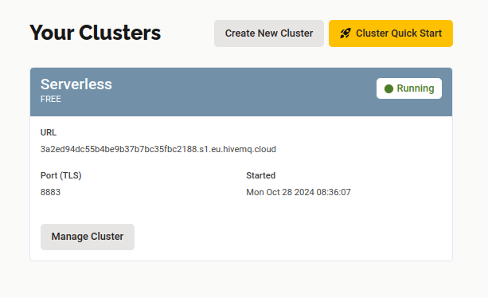
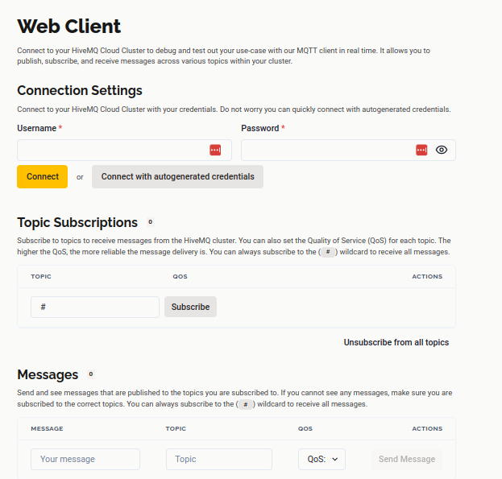
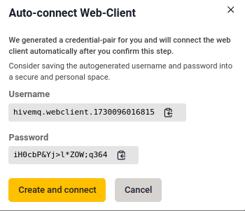
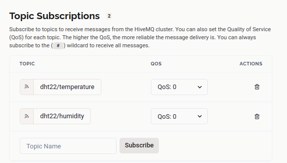
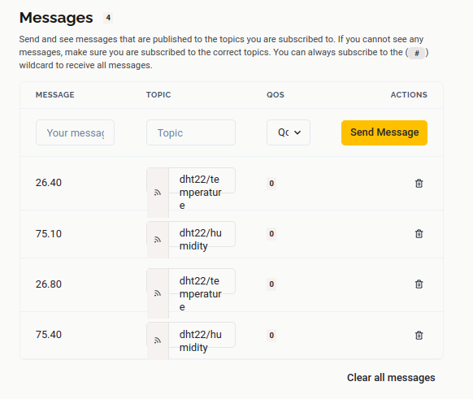

# IOT-SCHOOL Training

## Course Session Title: IoT Communication Protocols & Topologies

### Overview
This training module introduces participants to foundational IoT communication protocols and network topologies. It covers practical examples and theories for understanding, selecting, and implementing the correct protocols and topologies in real-world IoT solutions.

---

### Course Content

#### 1. Introduction to IoT Protocols
   - **Definition and Role of IoT**  
     IoT (Internet of Things) connects devices to the internet, enabling real-time data sharing and automation.

   - **Importance of Communication Protocols**  
     Communication protocols facilitate device interaction, allowing for efficient and secure IoT solutions.

#### 2. Types of IoT Protocols
   - **Data Protocols**  
     - **MQTT** (Message Queuing Telemetry Transport): Lightweight, ideal for low-bandwidth communication.
     - **HTTP** (Hypertext Transfer Protocol): Heavier, used for web-based applications with complex data needs.

   - **Networking Protocols**  
     - **WiFi**: High-speed, short-range.
     - **Bluetooth**: Low power, short-range, ideal for portable devices.
     - **GSM**: Long-range, used in cellular IoT.
     - **LoRa**: Low-power, long-range, suited for remote IoT.

#### 3. IoT Protocol Selection & Significance
   - **Criteria for Selecting the Right Protocol**  
     Considerations include data rate, power efficiency, latency, network range, and device compatibility.

   - **Comparison Between MQTT and HTTP**  
     - **MQTT**: Efficient for low-bandwidth, real-time messaging.
     - **HTTP**: Better for user-driven applications needing detailed data transfer.

#### 4. OSI Model & Key Layers for IoT
   - **The Seven Layers of the OSI Model**  
     - Physical, Data Link, Network, Transport, Session, Presentation, Application.

   - **Key Layers for IoT Communication**  
     - **Physical Layer**: Involves sensors and device interfaces.
     - **Network Layer**: Defines addressing and routing.
     - **Application Layer**: Manages user interaction with IoT data, typically using MQTT or HTTP.

#### 5. Practical Example 1: ESP32 and MQTT Protocol
  - **Scenario**: Using ESP32 with a DHT22 sensor for temperature and humidity monitoring.
  - **Objective**: Transmit sensor data via MQTT to HiveMQ.
  - **Key Steps**:
    - Connect ESP32 to WiFi.
    - Program it to read DHT22 data.
    - Publish DHT sensor data to HiveMQ via MQTT.

  - **Configuration**: ESP32 - HiveMQ Connection
    - Go to [HiveMQ](https://www.hivemq.com/)
      - Click `Start Free`
      - Next, under **Get Started with HiveMQ**, select `HiveMQ Cloud` by clicking the `Sign Up Free Now` button.
      - You’ll be redirected to a Register/Login prompt page.
        - **Login** (if you already have an account) or **Register** (if you're new) using the provided options.
      - After successful authentication, you'll be redirected to **Select the HiveMQ Cloud plan you need** section.

        

      - Under the **Serverless** FREE option, click `Create Serverless Cluster` to create a cluster.
      - Once the serverless cluster is created, you'll be redirected to **Your Clusters** section.

        

      - In the newly created serverless cluster, click `Manage Cluster` to access cluster information.

        

      - **Cluster Information Section**
        - **Overview**: Provides cluster (HiveMQ broker) information and connection parameters.
          - **Cluster URL**: This is the MQTT server URL required for the broker connection from ESP32 code.
          - **Port 8883**: This is the MQTT server secure connection port required for broker connection from ESP32 code.

        - **Web Client**: Provides a test environment for the HiveMQ broker.

          

          - **Connection Settings**: Allows you to set `Username` and `Password`, which are required for broker connection from ESP32 code.
            - **Note**:
              - You can create custom credentials (Username & Password) or
              - Use the autogenerated credentials by clicking `connect with autogenerated credentials` (recommended for secure, strong credentials).

              

            - After entering the Username and Password fields, click the `Connect` button to initiate the broker connection.

            

          - **Topic Subscriptions**: Allows you to set MQTT broker `Subscribe topics`.
            - **Note**:
              - Through `topics`, we can `publish` and `subscribe` to the MQTT broker from the ESP32 for sensor data transmission and reception.

            - To set a topic for data publishing from ESP32, enter the defined topic from the ESP32 code in the `TOPIC` field and click `Subscribe`. This puts the HiveMQ broker into listening mode for any data published from ESP32 via the subscribed topics and displays it under the Messages section whenever received.

            

          - **Messages**: Provides a data visualization section.
            - Data published from the ESP32 to the HiveMQ broker via subscribed topics is displayed in the Messages section.
            - It’s also possible to publish a message back to the ESP32 via the defined publish topics. Click `Send Message` to send a message to the ESP32 module.

            

#### 6. Network Topologies
   - **Definition**: Arrangement of nodes and connections in a network.

   - **Types of Topologies**  
     - **Star Topology**: Centralized, vulnerable if hub fails.
     - **Mesh Topology**: High redundancy, reliable.
     - **Bus Topology**: Simple, less scalable.
     - **Ring Topology**: Efficient for small networks.

   - **Topology Selection & Considerations**  
     Factors include network size, scalability, reliability, and maintenance complexity.

#### 7. Practical Example 2: Mesh Topology Demonstration Using ESP32
   - **Scenario**: Using ESP32 devices in a mesh network for a smart home or agriculture setup.
   - **Objective**: Demonstrate data redundancy and network robustness.
   - **Key Steps**:
     - Configure ESP32 devices for mesh.
     - Simulate data transmission in a mesh network.

---

### Learning Outcomes
By the end of this training, participants will:
   - Understand IoT communication protocols and topologies.
   - Select suitable protocols for specific IoT applications.
   - Gain hands-on experience with MQTT and ESP32.
   - Recognize and select appropriate network topologies.
   - Demonstrate practical knowledge of MQTT and mesh topology.

---

### Resources
- [Network Protocols](https://www.graniteriverlabs.com/en-us/technical-blog/iot-network-protocol-considerations#navbar_global)
- [Network Protocols Impact on IoT Solutions](https://saft.com/energizing-iot/impact-communication-technology-protocol-your-iot-application%E2%80%99s-power-consumption)
- [IoT Protocols Standards](https://www.nabto.com/guide-iot-protocols-standards/)
- [Network Topologies](https://www.techtarget.com/searchnetworking/definition/network-topology#:~:text=What%20is%20a%20network%20topology,often%20represented%20as%20a%20graph.)
- [HiveMQ Documentation](https://console.hivemq.cloud)
- **ESP32 Documentation**: Official ESP32 guide for MQTT and WiFi configurations.
- **DHT22 Documentation**: Guide on data readings and calibration.

---

### Acknowledgments
This training is organized by **Angaza Elimu** and **ALX - IoT School, Cohort 1, 2024** to build a foundation in IoT communication protocols and network topologies for IoT enthusiasts and professionals.
